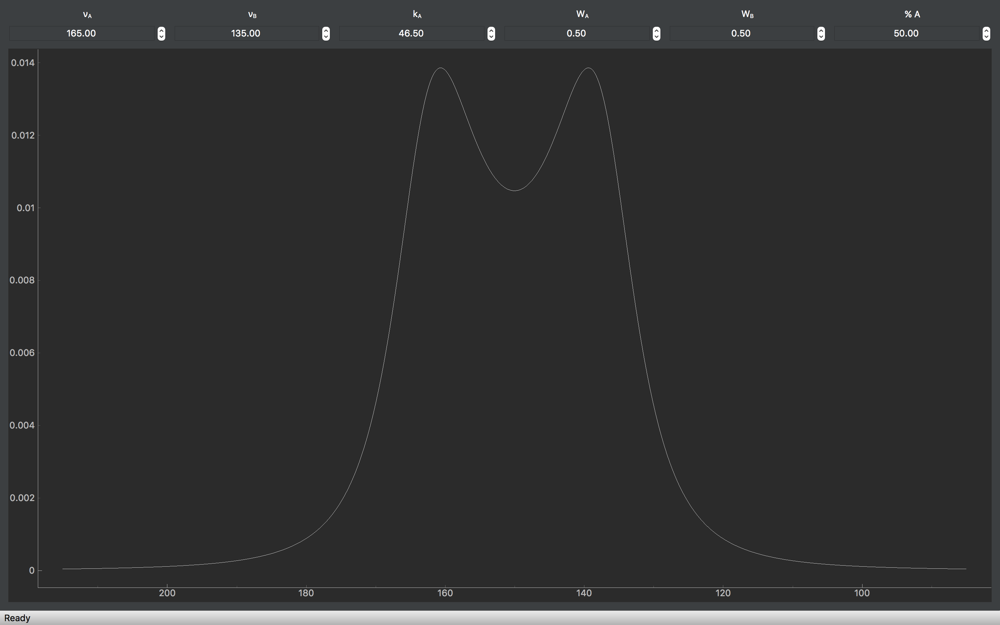

pyDNMR v0.5.0 (beta)
*********************

`Documentation (.pdf)`_.

.. _Documentation (.pdf): docs/build/latex/pyDNMR.pdf

Stand-alone executable applications for Windows and OS X here_.

.. _here: https://github.com/sametz/pydnmr/releases/tag/v0.3.0

pyDNMR simulates dynamic nuclear magnetic resonance (DNMR) spectra. A graphical user interface provides inputs for simulation parameters (frequencies, rate constants, line widths, and the population of various states), and displays the resulting spectrum.

The current version of pyDNMR includes simulations for two spin-1/2 nuclei
 undergoing exchange. The short-term goal of this project is to provide
 platform-specific executable files ("apps") for educational use. For example, the rate constant for nuclear exchange can be adjusted up and down to demonstrate coalescence of signals.

The longer-term goal of this project is to add simulations for more complex systems, and to provide additional tools (e.g. importation of NMR spectra, and matching experimental to simulated lineshapes) that would result in an application suitable for researchers as well as educators.

A secondary purpose of this project is to provide a test case for the author to learn how to properly test, package, and distribute software. Which leads to:

----

Installation and Use
====================

For Windows and Mac OS X, the application is frozen as a single-file,
double-click-to-run application (see link above). Nothing besides the executable file needs to be installed. The description below is only for users that
want to download and run the Python source code itself.

The essential package components required to run the application are main.py plus the pydnmr subfolder and its contents. The application can be launched by running main.py: ::

    $ python main.py

The code should work for Python version 3.5 and up. The dependencies listed in requirements.txt are also required.
If pip is installed, the following command should automatically install the required dependencies: ::

    >>>pip install -r requirements.txt

If you are familiar with virtual environments (e.g. using virtualenv, venv, or conda), you may wish to create one specifically for running this code, and install requirements there. If you use an Anaconda installation of Python, it is quite easy to set up and switch between different environments. See `the conda documentation`_ for details.

.. _the conda documentation: https://conda.io/docs/using/envs.html

----

TODO:
=====

Steps to a Version 1 release:

* Check PEP8/PEP257 compliance for code style

* Create a Linux standalone app for Linux as well

See the CHANGELOG for the anticipated changes required to progress from alpha to beta to pre-release to Version 1.0.0.

----

Feedback
========
Disclaimer: the author is neither an NMR spectroscopist, nor a software engineer. I'm figuring this out as I go along. I welcome feedback on the project. If you think the simulation or the code could be improved upon, feel free to leave an issue on GitHub, or contact me by email (see setup.py for my current address).

----

Acknowledgements
================
This project is inspired by Hans Reich's WINDNMR application. I thank him for our conversations, and his sharing of WINDNMR's Visual Basic 6 code.
